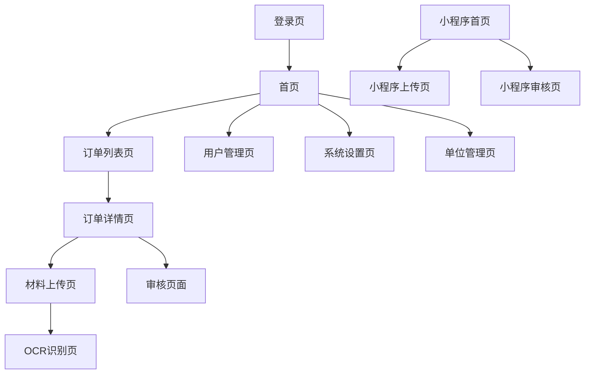

## 1. 产品概述

国补订单资料上传系统是一个专门为国家补贴订单材料管理而设计的综合性平台。系统主要解决订单相关资料（SN码图片、安装图片、物流图片、激活图片等）的规范化收集、管理和审核问题。

通过PC端和小程序双端协同，为不同角色的用户提供便捷的材料上传和管理功能，确保国补订单材料的完整性和准确性，提高补贴申请效率。

**核心特点**：系统支持多租户隔离，按销售单位（组织）进行数据隔离，各单位之间数据互相独立，确保数据安全性和隐私性。

## 2. 核心功能

### 2.1 用户角色

| 角色     | 注册方式   | 核心权限                       | 组织归属 |
| -------- | ---------- | ------------------------------ | -------- |
| 单位用户（普通用户） | 单位管理员分配 | 上传订单材料、查看本单位订单状态 | 必须归属特定销售单位 |
| 审核员   | 管理员分配 | 审核订单材料、标记审核状态     | 可查看所有单位数据 |
| 管理员   | 系统初始化 | 用户管理、系统配置、数据导出   | 可查看所有单位数据 |
| 安装师傅 | 邀请注册   | 上传安装图片、查看分配订单     | 必须归属特定销售单位 |

### 2.2 功能模块

系统包含以下核心功能模块：

1. **单位/组织管理模块**：销售单位创建、单位信息管理、单位用户分配
2. **订单管理模块**：订单导入、订单查询、订单状态跟踪
3. **材料上传模块**：SN码图片、安装图片、物流图片、激活图片上传
4. **OCR识别模块**：SN码自动识别、识别结果校对
5. **审核管理模块**：材料审核、审核记录、问题反馈
6. **用户管理模块**：用户注册、权限分配、角色管理
7. **小程序模块**：拍照上传、订单查询、消息通知

### 2.3 页面详情

| 页面名称     | 模块名称 | 功能描述                                                     |
| ------------ | -------- | ------------------------------------------------------------ |
| 登录页       | 用户认证 | 支持手机号+验证码登录，支持记住登录状态                      |
| 首页         | 数据概览 | 显示本单位待处理订单数、审核通过率、今日上传量等关键指标（单位用户只能看到本单位数据） |
| 订单列表页   | 订单管理 | 列表展示本单位订单信息，支持按状态、时间、订单号筛选，支持批量操作（单位用户只能看到本单位订单） |
| 订单详情页   | 材料上传 | 展示订单基本信息，提供各类图片上传入口，支持图片预览和删除   |
| 材料上传页   | 图片上传 | 支持拖拽上传、拍照上传，自动压缩图片，显示上传进度           |
| OCR识别页    | SN码识别 | 自动识别SN码图片中的编号，支持手动校正识别结果               |
| 审核页面     | 材料审核 | 查看订单所有材料，支持通过/驳回操作，填写审核意见（审核员可查看所有单位订单） |
| 用户管理页   | 用户列表 | 展示系统用户，支持添加、编辑、禁用用户操作（管理员功能）     |
| 单位管理页   | 单位列表 | 展示销售单位列表，支持添加、编辑单位信息，分配单位用户（管理员功能） |
| 系统设置页   | 配置管理 | 上传规则配置、审核流程配置、系统参数设置                     |
| 小程序首页   | 订单列表 | 展示当前用户的订单列表，支持扫码查询订单（只能看到本单位订单） |
| 小程序上传页 | 拍照上传 | 调用摄像头拍照，支持多张连续拍摄，自动上传                   |
| 小程序审核页 | 审核查看 | 查看审核结果和审核意见                                       |

## 3. 核心流程

### 3.1 单位用户流程

用户登录 → 选择所属单位 → 查看本单位订单列表 → 选择订单 → 上传材料 → 提交审核 → 查看审核结果

### 3.2 安装师傅流程

师傅登录 → 选择所属单位 → 查看本单位分配订单 → 现场拍照上传 → 标记安装完成 → 查看审核结果

### 3.3 审核员流程

审核员登录 → 查看所有单位待审核列表 → 审核材料 → 填写意见 → 提交审核结果

### 3.4 管理员流程

管理员登录 → 管理销售单位 → 分配单位用户 → 查看系统整体数据 → 导出报表

### 3.5 页面导航流程

## 4. 用户界面设计

### 4.1 设计规范

**色彩方案**：

- 主色调：#1890ff（科技蓝）
- 辅助色：#52c41a（成功绿）、#faad14（警告黄）、#f5222d（错误红）
- 中性色：#fafafa（背景灰）、#f0f0f0（边框灰）

**字体规范**：

- 主字体：PingFang SC、Hiragino Sans GB、Microsoft YaHei
- 标题：18px，加粗
- 正文：14px，常规
- 辅助文字：12px，常规，灰色

**组件风格**：

- 按钮：圆角4px，主按钮使用主色调
- 输入框：圆角4px，边框1px
- 卡片：阴影+圆角，hover效果
- 图标：使用Ant Design图标库

### 4.2 页面设计概述

| 页面名称     | 模块名称 | UI元素                                             |
| ------------ | -------- | -------------------------------------------------- |
| 首页         | 数据卡片 | 使用卡片布局展示关键指标，包含图标、数字、趋势变化 |
| 订单列表页   | 筛选区域 | 顶部筛选栏，包含日期选择器、状态选择器、搜索框     |
| 订单详情页   | 信息展示 | 左侧订单信息，右侧材料上传区域，分标签页展示       |
| 材料上传页   | 上传区域 | 拖拽上传框，支持多文件，显示缩略图和上传进度       |
| OCR识别页    | 识别结果 | 左侧原图，右侧识别结果，支持手动编辑               |
| 小程序上传页 | 拍照界面 | 全屏相机界面，底部拍照按钮，支持连拍模式           |
| 单位管理页   | 单位列表 | 表格展示单位信息，支持搜索、添加、编辑操作         |

### 4.3 响应式设计

- **桌面端优先**：设计基准为1920x1080分辨率
- **平板适配**：768px-1024px，采用自适应布局
- **移动端**：小于768px，采用单列布局，重要功能优先展示

### 4.4 小程序特殊设计

- **拍照界面**：全屏相机，简洁的拍照按钮
- **上传提示**：实时显示上传进度，支持后台上传
- **网络适配**：弱网环境下自动压缩图片，支持断点续传
- **离线缓存**：支持离线拍照，网络恢复后自动上传

## 5. 非功能性需求

### 5.1 性能要求

- 页面加载时间：< 3秒
- 图片上传速度：< 10秒/张（压缩后）
- OCR识别时间：< 5秒
- 并发用户支持：1000+ 同时在线

### 5.2 安全要求

- 用户密码加密存储
- 图片上传支持HTTPS
- 接口访问需要token验证
- 敏感操作需要二次验证
- **数据隔离**：单位之间数据严格隔离，用户只能访问所属单位数据
- **权限控制**：基于角色的细粒度权限控制

### 5.3 可靠性要求

- 系统可用性：99.9%
- 数据备份：每日自动备份
- 故障恢复：RTO < 1小时，RPO < 15分钟
- **数据完整性**：确保单位数据隔离不泄露

### 5.4 兼容性要求

- PC端：支持Chrome、Firefox、Safari、Edge最新版本
- 小程序：支持微信、支付宝小程序
- 移动端：支持iOS 12+、Android 8+