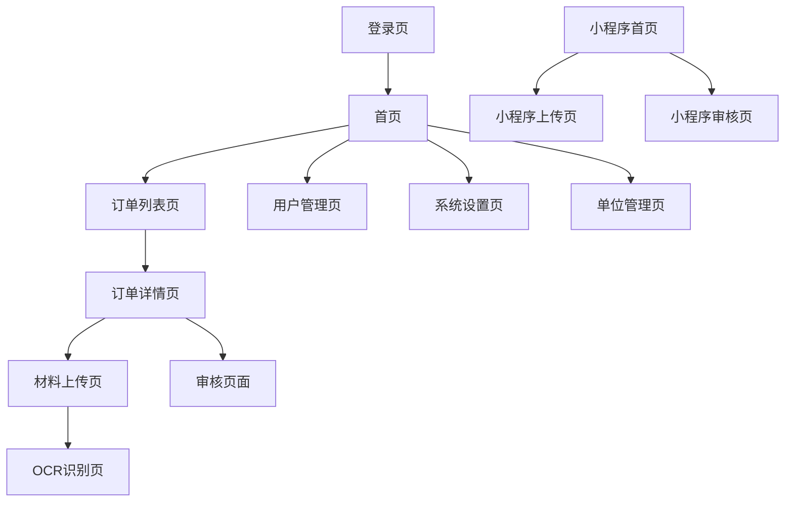
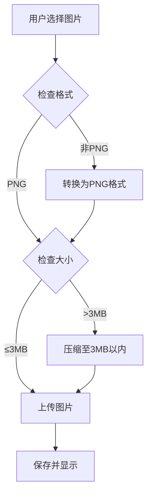
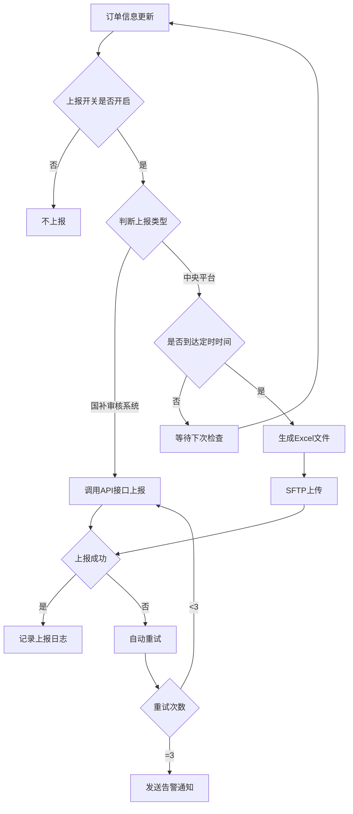
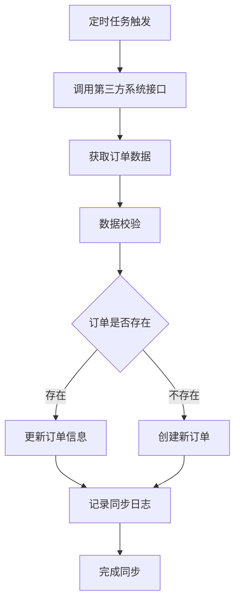

## 1. 产品概述

国补订单资料上传系统是一个专门为国家补贴订单材料管理而设计的综合性平台。系统主要解决订单相关资料（SN码图片、安装图片、物流图片、激活图片等）的规范化收集、管理和审核问题。

通过PC端和小程序双端协同，为不同角色的用户提供便捷的材料上传和管理功能，确保国补订单材料的完整性和准确性，提高补贴申请效率。

**核心特点**：系统支持多租户隔离，按销售单位（组织）进行数据隔离，各单位之间数据互相独立，确保数据安全性和隐私性。

## 2. 核心功能

### 2.1 用户角色

| 角色                 | 注册方式       | 核心权限                         | 组织归属             |
| -------------------- | -------------- | -------------------------------- | -------------------- |
| 单位用户（普通用户） | 单位管理员分配 | 上传订单材料、查看本单位订单状态 | 必须归属特定销售单位 |
| 审核员               | 管理员分配     | 审核订单材料、标记审核状态       | 可查看所有单位数据   |
| 管理员               | 系统初始化     | 用户管理、系统配置、数据导出     | 可查看所有单位数据   |
| 安装师傅             | 邀请注册       | 上传安装图片、查看分配订单       | 必须归属特定销售单位 |

### 2.2 功能模块

系统包含以下核心功能模块：

### 2.2 功能模块

1. **单位/组织管理模块**：销售单位创建、单位信息管理、单位用户分配
2. **订单管理模块**：订单导入、订单查询、订单状态跟踪、第三方订单数据同步
3. **材料上传模块**：SN码图片、安装图片、物流图片、激活图片上传、图片格式转换和压缩
4. **OCR识别模块**：SN码自动识别、识别结果校对、SN码专项优化（图像增强、特征校验）
5. **审核管理模块**：材料审核、审核记录、问题反馈
6. **用户管理模块**：用户注册、权限分配、角色管理
7. **数据上报模块**：国补资料审核系统上报、中央平台上报系统上报、上报开关配置
8. **小程序模块**：拍照上传、订单查询、消息通知

### 2.3 页面详情

| 页面名称       | 模块名称 | 功能描述                                                                                         |
| -------------- | -------- | ------------------------------------------------------------------------------------------------ |
| 登录页         | 用户认证 | 支持手机号+验证码登录，支持记住登录状态                                                          |
| 首页           | 数据概览 | 显示本单位待处理订单数、审核通过率、今日上传量等关键指标（单位用户只能看到本单位数据）           |
| 订单列表页     | 订单管理 | 列表展示本单位订单信息，支持按状态、时间、订单号筛选，支持批量操作（单位用户只能看到本单位订单） |
| 订单详情页     | 材料上传 | 展示订单基本信息，提供各类图片上传入口，支持图片预览和删除                                       |
| 材料上传页     | 图片上传 | 支持拖拽上传、拍照上传，自动压缩图片，显示上传进度                                               |
| OCR识别页      | SN码识别 | 自动识别SN码图片中的编号，支持手动校正识别结果                                                   |
| 审核页面       | 材料审核 | 查看订单所有材料，支持通过/驳回操作，填写审核意见（审核员可查看所有单位订单）                    |
| 用户管理页     | 用户列表 | 展示系统用户，支持添加、编辑、禁用用户操作（管理员功能）                                         |
| 单位管理页     | 单位列表 | 展示销售单位列表，支持添加、编辑单位信息，分配单位用户（管理员功能）                             |
| 系统设置页     | 配置管理 | 上传规则配置、审核流程配置、系统参数设置                                                         |
| 数据上报配置页 | 上报管理 | 配置国补资料审核系统上报开关、中央平台上报开关、上报时间间隔、SFTP配置                           |
| 数据上报记录页 | 上报日志 | 查看数据上报记录、上报状态、上报失败重试                                                         |
| 小程序首页     | 订单列表 | 展示当前用户的订单列表，支持扫码查询订单（只能看到本单位订单）                                   |
| 小程序上传页   | 拍照上传 | 调用摄像头拍照，支持多张连续拍摄，自动上传，自动转换PNG格式                                      |
| 小程序审核页   | 审核查看 | 查看审核结果和审核意见                                                                           |

## 3. 核心流程

### 3.1 单位用户流程

用户登录 → 选择所属单位 → 查看本单位订单列表 → 选择订单 → 上传材料 → 提交审核 → 查看审核结果

### 3.2 安装师傅流程

师傅登录 → 选择所属单位 → 查看本单位分配订单 → 现场拍照上传 → 标记安装完成 → 查看审核结果

### 3.3 审核员流程

审核员登录 → 查看所有单位待审核列表 → 审核材料 → 填写意见 → 提交审核结果

### 3.4 管理员流程

管理员登录 → 管理销售单位 → 分配单位用户 → 查看系统整体数据 → 导出报表

### 3.5 页面导航流程

## 4. 用户界面设计

### 4.1 设计规范

**色彩方案**：

- 主色调：#1890ff（科技蓝）
- 辅助色：#52c41a（成功绿）、#faad14（警告黄）、#f5222d（错误红）
- 中性色：#fafafa（背景灰）、#f0f0f0（边框灰）

**字体规范**：

- 主字体：PingFang SC、Hiragino Sans GB、Microsoft YaHei
- 标题：18px，加粗
- 正文：14px，常规
- 辅助文字：12px，常规，灰色

**组件风格**：

- 按钮：圆角4px，主按钮使用主色调
- 输入框：圆角4px，边框1px
- 卡片：阴影+圆角，hover效果
- 图标：使用Ant Design图标库

### 4.2 页面设计概述

| 页面名称     | 模块名称 | UI元素                                             |
| ------------ | -------- | -------------------------------------------------- |
| 首页         | 数据卡片 | 使用卡片布局展示关键指标，包含图标、数字、趋势变化 |
| 订单列表页   | 筛选区域 | 顶部筛选栏，包含日期选择器、状态选择器、搜索框     |
| 订单详情页   | 信息展示 | 左侧订单信息，右侧材料上传区域，分标签页展示       |
| 材料上传页   | 上传区域 | 拖拽上传框，支持多文件，显示缩略图和上传进度       |
| OCR识别页    | 识别结果 | 左侧原图，右侧识别结果，支持手动编辑               |
| 小程序上传页 | 拍照界面 | 全屏相机界面，底部拍照按钮，支持连拍模式           |
| 单位管理页   | 单位列表 | 表格展示单位信息，支持搜索、添加、编辑操作         |

### 4.3 响应式设计

- **桌面端优先**：设计基准为1920x1080分辨率
- **平板适配**：768px-1024px，采用自适应布局
- **移动端**：小于768px，采用单列布局，重要功能优先展示

### 4.4 小程序特殊设计

- **拍照界面**：全屏相机，简洁的拍照按钮
- **上传提示**：实时显示上传进度，支持后台上传
- **网络适配**：弱网环境下自动压缩图片，支持断点续传
- **离线缓存**：支持离线拍照，网络恢复后自动上传
- **图片处理**：自动转换为PNG格式，确保文件大小不超过3MB

## 5. 图片处理规范

### 5.1 图片格式要求

- **目标格式**：PNG格式
- **文件大小限制**：不超过3MB
- **自动处理**：系统自动将非PNG格式图片转换为PNG格式
- **自动压缩**：超过3MB的图片自动压缩至3MB以内

### 5.2 图片上传流程

### 5.3 图片压缩策略

- **优先保证清晰度**：在保证SN码可识别的前提下进行压缩
- **压缩算法**：使用高效的PNG压缩算法（如pngquant）
- **质量控制**：压缩后保持足够的清晰度用于审核
- **批量处理**：支持多张图片批量转换和压缩

## 6. 数据上报功能

### 6.1 国补资料审核系统上报

- **上报方式**：通过API接口实时上报
- **上报触发**：开启上报开关后，订单信息更新时自动触发
- **上报频率**：可配置定时上报间隔（默认1小时）
- **上报开关**：管理员可配置开启/关闭上报功能
- **接口文档**：详见《湖南以旧换新企业垫资审核系统数据完善接口文档V1.2（试用稿）.pdf》

### 6.2 中央平台上报系统上报

- **上报方式**：SFTP上传Excel文件
- **上报频率**：每日定时上报一次（可配置上报时间）
- **上报内容**：订单及SN、item等详细信息的Excel文件
- **文件格式**：按照《全国家电以旧换新对接标准1.7（含3C）.docx》要求
- **上报标准**：使用"仅上传1份文件"的内容标准
- **上报开关**：管理员可配置开启/关闭上报功能

### 6.3 上报管理功能

- **上报配置**：配置上报开关、上报时间间隔、SFTP连接信息等
- **上报日志**：记录每次上报的时间、状态、结果
- **失败重试**：上报失败自动重试（最多3次）
- **状态监控**：实时监控上报任务状态
- **异常告警**：上报失败时发送告警通知

### 6.4 数据上报流程

## 7. 第三方订单集成

### 7.1 订单数据来源

- **数据来源**：第三方系统（暂未确定）
- **集成方式**：预留标准化接口
- **数据同步**：定时从第三方系统同步订单数据
- **最小业务单位**：以订单号为最小业务单位

### 7.2 接口设计原则

- **接口标准化**：提供标准化的订单数据接口
- **数据格式**：JSON格式，支持扩展字段
- **接口版本**：支持版本控制，便于后续升级
- **安全认证**：使用API Key或Token进行认证
- **数据校验**：对同步的订单数据进行完整性校验

### 7.3 订单数据同步流程

### 7.4 订单数据字段

#### 7.4.1 通用字段

- **基础信息**：主键ID、商户订单号、二级商户编号、商户报名区县、板块类型
- **发票信息**：发票号、开票日期、发票金额、发票抬头、发票项目名称、发票订单号、发票补贴金额、发票备注、平台发票订单号
- **商品信息**：商品名称、商品编码/69码、商品品牌、商品型号、商品品类、商品品类编码、单位、数量、商品明细
- **物流/交付**：配送方式、收货地址、自提/物流单号、签收时间
- **买卖方信息**：购买方识别码、销方识别码、销方单位

#### 7.4.2 品类差异化字段

| 字段/品类          | 家电 (Home Appliance)                         | 3C数码 (Digital 3C)                    | 家装 (Home Decoration)       | 适老化 (Aging Adaptation) |
| :----------------- | :-------------------------------------------- | :------------------------------------- | :--------------------------- | :------------------------ |
| **特有字段** | 电脑类型 (pcTp)` `商品能效 (goodsEnergy) | IMEI1码 (imei1)` `IMEI2码 (imei2) | 二级分类：能效 (goodsEnergy) | -                         |
| **SN码要求** | **必填** (S/N码)                        | **必填** (S/N码)                 | 可为空                       | 可为空                    |
| **Image0**   | 发票照片名                                    | 发票照片名                             | 发票照片名                   | 发票照片名                |
| **Image1**   | 送货单照片名                                  | SN码水印照片名                         | 销售清单或购物小票照片名     | 签购单照片名              |
| **Image2**   | SN码水印照片名                                | 商品激活照片名                         | 收货凭证照片名               | 送货单(签字)              |
| **Image3**   | 能效标识水印照片名                            | 商品正面照片名                         | 施工前照片名                 | 送货照片(水印)            |
| **Image4**   | 销售清单或购物小票照片名                      | 商品侧面照片或签收凭证照片名           | 施工后照片名                 | 购物小票/销售单图片       |
| **Image5**   | 实物照片名                                    | 商品背面照片名                         | 其他照片                     | 其他照片                  |

## 8. 非功能性需求

### 8.1 性能要求

- 页面加载时间：< 3秒
- 图片上传速度：< 10秒/张（压缩后）
- OCR识别时间：< 5秒
- 并发用户支持：1000+ 同时在线

### 8.2 安全要求

- 用户密码加密存储
- 图片上传支持HTTPS
- 接口访问需要token验证
- 敏感操作需要二次验证
- **数据隔离**：单位之间数据严格隔离，用户只能访问所属单位数据
- **权限控制**：基于角色的细粒度权限控制

### 8.3 可靠性要求

- 系统可用性：99.9%
- 数据备份：每日自动备份
- 故障恢复：RTO < 1小时，RPO < 15分钟
- **数据完整性**：确保单位数据隔离不泄露

### 8.4 兼容性要求

- PC端：支持Chrome、Firefox、Safari、Edge最新版本
- 小程序：支持微信、支付宝小程序
- 移动端：支持iOS 12+、Android 8+

## 9. OCR识别优化

### 9.1 SN码识别专项优化

- **图像预处理**：

  - **自动裁剪**：自动检测条形码/二维码区域，裁剪背景干扰
  - **图像增强**：自动进行二值化、去噪、锐化处理，提高字符对比度
  - **倾斜校正**：自动检测并校正图片倾斜角度
- **识别策略优化**：

  - **字符集限定**：针对SN码特性，限定识别字符集为（数字、大写字母），排除汉字和特殊符号干扰
  - **格式校验**：内置常见品牌SN码规则（正则匹配），自动修正易混淆字符（如0和O，1和I，8和B）
  - **多模式识别**：同时支持条形码/二维码扫描识别和纯文本OCR识别，双重验证

### 9.2 人工辅助校对

- **置信度提示**：对低置信度的识别字符进行高亮提示（如红色标注）
- **原图对照**：校对界面提供局部放大镜功能，鼠标悬停时放大对应原图区域
- **历史记忆**：记录用户的修正操作，用于后续优化识别模型
