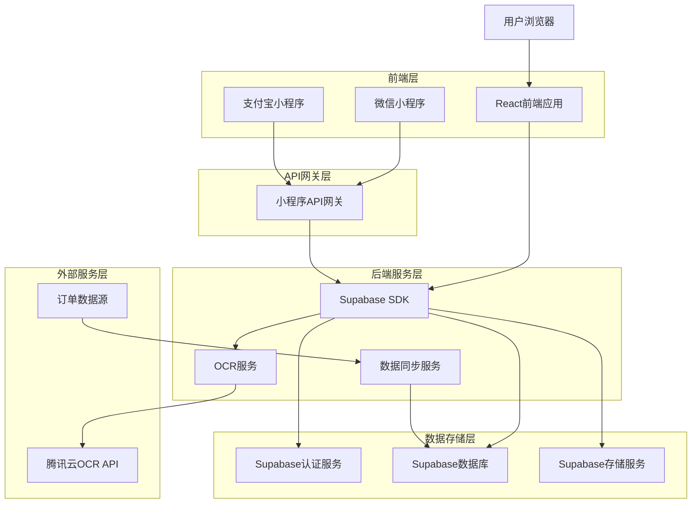
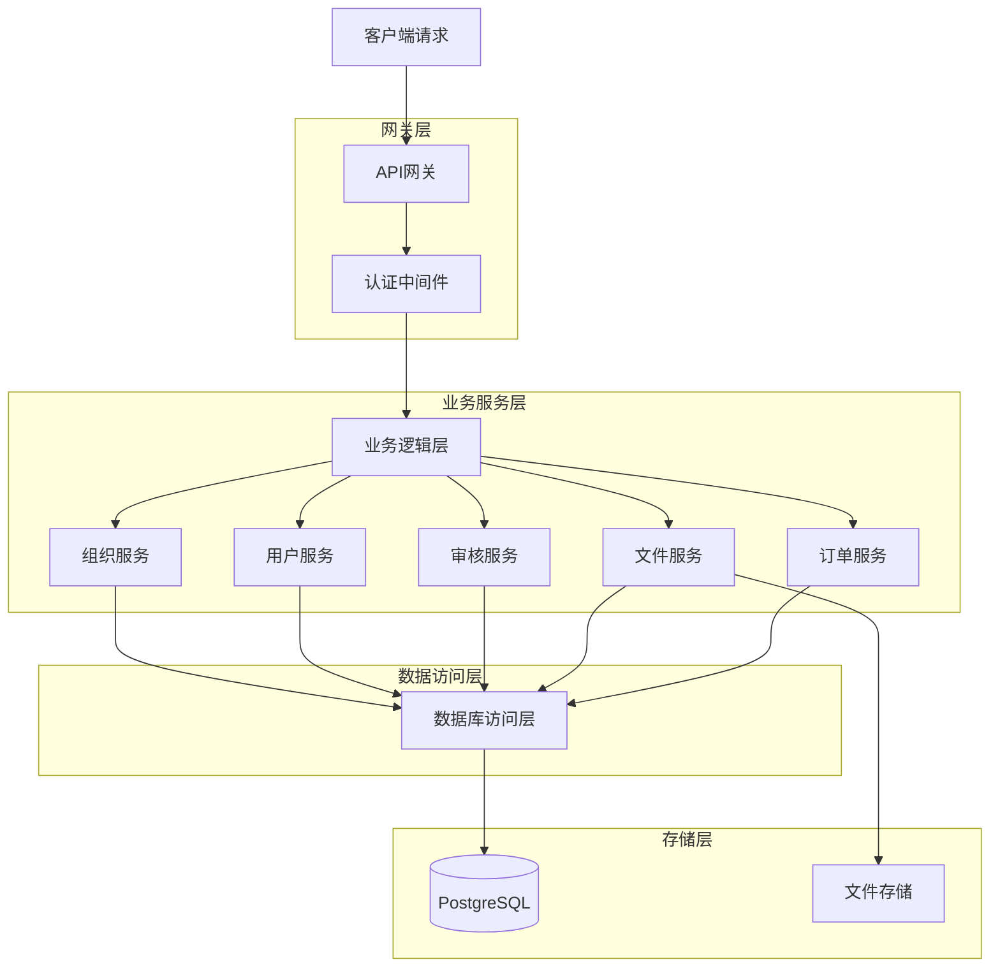
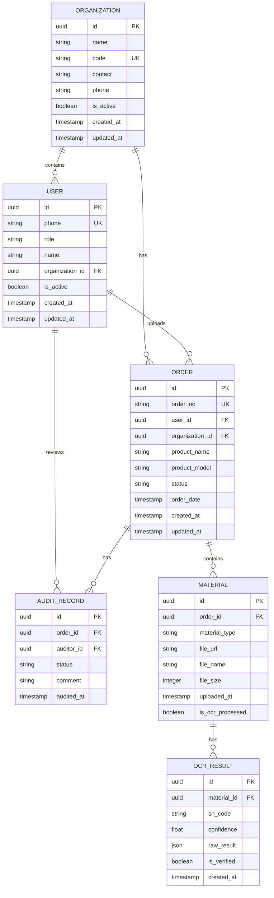

## 1. 架构设计



## 2. 技术栈描述

### 2.1 前端技术栈

* **PC端**: React@18 + TypeScript + Ant Design@5 + Vite

* **小程序**: 微信小程序原生开发 + Taro跨平台框架

* **状态管理**: Zustand轻量级状态管理

* **UI框架**: Ant Design (PC端) + Vant Weapp (小程序端)

* **初始化工具**: vite-init (PC端) + @tarojs/cli (小程序)

### 2.2 后端技术栈

* **后端服务**: Supabase (BaaS平台)

* **认证服务**: Supabase Auth (支持手机号验证码登录)

* **数据库**: PostgreSQL (通过Supabase提供)

* **文件存储**: Supabase Storage

* **实时功能**: Supabase Realtime

### 2.3 第三方服务

* **OCR识别**: 腾讯云OCR API

* **短信服务**: 阿里云短信服务

* **文件存储**: 阿里云OSS (备选方案)

## 3. 路由定义

### 3.1 PC端路由

| 路由                 | 用途     |
| ------------------ | ------ |
| /                  | 登录页    |
| /dashboard         | 首页仪表板  |
| /orders            | 订单列表页  |
| /orders/:id        | 订单详情页  |
| /orders/:id/upload | 材料上传页  |
| /orders/:id/ocr    | OCR识别页 |
| /audit             | 审核管理页  |
| /users             | 用户管理页  |
| /organizations     | 单位管理页  |
| /settings          | 系统设置页  |
| /profile           | 个人中心   |

### 3.2 小程序路由

| 页面路径                | 用途    |
| ------------------- | ----- |
| pages/index/index   | 小程序首页 |
| pages/orders/list   | 订单列表  |
| pages/orders/detail | 订单详情  |
| pages/upload/photo  | 拍照上传  |
| pages/audit/result  | 审核结果  |
| pages/user/profile  | 用户中心  |

## 4. API定义

### 4.1 认证相关API

#### 用户登录

```
POST /auth/login
```

请求参数：

| 参数名   | 类型     | 必填 | 描述    |
| ----- | ------ | -- | ----- |
| phone | string | 是  | 手机号   |
| code  | string | 是  | 短信验证码 |

响应：

```json
{
  "access_token": "jwt_token_string",
  "refresh_token": "refresh_token_string",
  "user": {
    "id": "user_id",
    "phone": "13800138000",
    "role": "user",
    "organization_id": "org_id"
  }
}
```

#### 获取验证码

```
POST /auth/sms-code
```

请求参数：

| 参数名   | 类型     | 必填 | 描述  |
| ----- | ------ | -- | --- |
| phone | string | 是  | 手机号 |

### 4.2 组织管理API

#### 创建单位

```
POST /api/organizations
```

请求参数：

| 参数名   | 类型     | 必填 | 描述    |
| ----- | ------ | -- | ----- |
| name    | string | 是  | 单位名称 |
| code    | string | 是  | 单位编码 |
| contact | string | 否  | 联系人  |
| phone   | string | 否  | 联系电话 |

#### 获取单位列表

```
GET /api/organizations
```

### 4.3 订单相关API

#### 获取订单列表

```
GET /api/orders
```

查询参数：

| 参数名         | 类型     | 必填 | 描述        |
| ----------- | ------ | -- | --------- |
| page        | number | 否  | 页码，默认1    |
| limit       | number | 否  | 每页条数，默认20 |
| status      | string | 否  | 订单状态      |
| start_date | string | 否  | 开始日期      |
| end_date   | string | 否  | 结束日期      |
| organization_id | string | 否  | 单位ID（管理员/审核员可用） |

#### 上传订单材料

```
POST /api/orders/:id/materials
```

请求体（FormData）：

```json
{
  "sn_image": File,
  "install_image": File,
  "logistics_image": File,
  "activate_image": File,
  "material_type": "sn|install|logistics|activate"
}
```

### 4.4 OCR识别API

#### SN码识别

```
POST /api/ocr/sn-code
```

请求参数：

| 参数名        | 类型     | 必填 | 描述    |
| ---------- | ------ | -- | ----- |
| image_url | string | 是  | 图片URL |

响应：

```json
{
  "success": true,
  "data": {
    "sn_code": "SN123456789",
    "confidence": 0.95
  }
}
```

## 5. 服务器架构设计



## 6. 数据模型设计

### 6.1 实体关系图



### 6.2 数据定义语言

#### 单位表

```sql
CREATE TABLE organizations (
    id UUID PRIMARY KEY DEFAULT gen_random_uuid(),
    name VARCHAR(200) NOT NULL,
    code VARCHAR(50) UNIQUE NOT NULL,
    contact VARCHAR(100),
    phone VARCHAR(20),
    is_active BOOLEAN DEFAULT true,
    created_at TIMESTAMP WITH TIME ZONE DEFAULT NOW(),
    updated_at TIMESTAMP WITH TIME ZONE DEFAULT NOW()
);

-- 创建索引
CREATE INDEX idx_organizations_code ON organizations(code);
CREATE INDEX idx_organizations_name ON organizations(name);

-- 授权
GRANT SELECT ON organizations TO anon;
GRANT ALL PRIVILEGES ON organizations TO authenticated;
```

#### 用户表

```sql
CREATE TABLE users (
    id UUID PRIMARY KEY DEFAULT gen_random_uuid(),
    phone VARCHAR(20) UNIQUE NOT NULL,
    password_hash VARCHAR(255),
    name VARCHAR(100),
    role VARCHAR(20) DEFAULT 'user' CHECK (role IN ('user', 'auditor', 'admin', 'installer')),
    organization_id UUID REFERENCES organizations(id),
    is_active BOOLEAN DEFAULT true,
    created_at TIMESTAMP WITH TIME ZONE DEFAULT NOW(),
    updated_at TIMESTAMP WITH TIME ZONE DEFAULT NOW()
);

-- 创建索引
CREATE INDEX idx_users_phone ON users(phone);
CREATE INDEX idx_users_role ON users(role);
CREATE INDEX idx_users_organization_id ON users(organization_id);

-- 授权
GRANT SELECT ON users TO anon;
GRANT ALL PRIVILEGES ON users TO authenticated;
```

#### 订单表

```sql
CREATE TABLE orders (
    id UUID PRIMARY KEY DEFAULT gen_random_uuid(),
    order_no VARCHAR(50) UNIQUE NOT NULL,
    user_id UUID REFERENCES users(id),
    organization_id UUID REFERENCES organizations(id),
    product_name VARCHAR(200),
    product_model VARCHAR(100),
    status VARCHAR(20) DEFAULT 'pending' CHECK (status IN ('pending', 'uploading', 'auditing', 'approved', 'rejected')),
    order_date TIMESTAMP WITH TIME ZONE,
    created_at TIMESTAMP WITH TIME ZONE DEFAULT NOW(),
    updated_at TIMESTAMP WITH TIME ZONE DEFAULT NOW()
);

-- 创建索引
CREATE INDEX idx_orders_user_id ON orders(user_id);
CREATE INDEX idx_orders_organization_id ON orders(organization_id);
CREATE INDEX idx_orders_status ON orders(status);
CREATE INDEX idx_orders_order_no ON orders(order_no);
CREATE INDEX idx_orders_created_at ON orders(created_at DESC);

-- 授权
GRANT SELECT ON orders TO anon;
GRANT ALL PRIVILEGES ON orders TO authenticated;
```

#### 材料表

```sql
CREATE TABLE materials (
    id UUID PRIMARY KEY DEFAULT gen_random_uuid(),
    order_id UUID REFERENCES orders(id) ON DELETE CASCADE,
    material_type VARCHAR(20) CHECK (material_type IN ('sn', 'install', 'logistics', 'activate')),
    file_url TEXT NOT NULL,
    file_name VARCHAR(255),
    file_size INTEGER,
    uploaded_at TIMESTAMP WITH TIME ZONE DEFAULT NOW(),
    is_ocr_processed BOOLEAN DEFAULT false
);

-- 创建索引
CREATE INDEX idx_materials_order_id ON materials(order_id);
CREATE INDEX idx_materials_type ON materials(material_type);

-- 授权
GRANT SELECT ON materials TO anon;
GRANT ALL PRIVILEGES ON materials TO authenticated;
```

#### OCR结果表

```sql
CREATE TABLE ocr_results (
    id UUID PRIMARY KEY DEFAULT gen_random_uuid(),
    material_id UUID REFERENCES materials(id) ON DELETE CASCADE,
    sn_code VARCHAR(100),
    confidence FLOAT,
    raw_result JSONB,
    is_verified BOOLEAN DEFAULT false,
    created_at TIMESTAMP WITH TIME ZONE DEFAULT NOW()
);

-- 创建索引
CREATE INDEX idx_ocr_material_id ON ocr_results(material_id);
CREATE INDEX idx_ocr_sn_code ON ocr_results(sn_code);

-- 授权
GRANT SELECT ON ocr_results TO anon;
GRANT ALL PRIVILEGES ON ocr_results TO authenticated;
```

#### 审核记录表

```sql
CREATE TABLE audit_records (
    id UUID PRIMARY KEY DEFAULT gen_random_uuid(),
    order_id UUID REFERENCES orders(id) ON DELETE CASCADE,
    auditor_id UUID REFERENCES users(id),
    status VARCHAR(20) CHECK (status IN ('approved', 'rejected')),
    comment TEXT,
    audited_at TIMESTAMP WITH TIME ZONE DEFAULT NOW()
);

-- 创建索引
CREATE INDEX idx_audit_order_id ON audit_records(order_id);
CREATE INDEX idx_audit_auditor_id ON audit_records(auditor_id);
CREATE INDEX idx_audit_audited_at ON audit_records(audited_at DESC);

-- 授权
GRANT SELECT ON audit_records TO anon;
GRANT ALL PRIVILEGES ON audit_records TO authenticated;
```

### 6.3 行级安全策略(RLS)

#### 用户数据隔离策略

```sql
-- 用户只能查看自己组织的数据（普通用户和安装师傅）
CREATE POLICY "用户只能查看本单位数据" ON orders
    FOR SELECT
    USING (
        organization_id = (
            SELECT organization_id FROM users WHERE id = auth.uid()
        ) 
        OR 
        EXISTS (
            SELECT 1 FROM users WHERE id = auth.uid() 
            AND role IN ('admin', 'auditor')
        )
    );

-- 用户只能查看自己组织的数据（材料表）
CREATE POLICY "用户只能查看本单位材料" ON materials
    FOR SELECT
    USING (
        EXISTS (
            SELECT 1 FROM orders 
            WHERE orders.id = materials.order_id 
            AND orders.organization_id = (
                SELECT organization_id FROM users WHERE id = auth.uid()
            )
        )
        OR 
        EXISTS (
            SELECT 1 FROM users WHERE id = auth.uid() 
            AND role IN ('admin', 'auditor')
        )
    );

-- 用户只能查看自己组织的数据（用户表）
CREATE POLICY "用户只能查看本单位用户" ON users
    FOR SELECT
    USING (
        organization_id = (
            SELECT organization_id FROM users WHERE id = auth.uid()
        ) 
        OR 
        role IN ('admin', 'auditor')
    );
```

#### 数据修改策略

```sql
-- 普通用户只能修改自己的数据
CREATE POLICY "用户只能修改自己的数据" ON orders
    FOR UPDATE
    USING (
        user_id = auth.uid()
        AND status IN ('pending', 'uploading')
    );

-- 审核员可以更新订单状态
CREATE POLICY "审核员可以审核订单" ON orders
    FOR UPDATE
    USING (
        EXISTS (
            SELECT 1 FROM users WHERE id = auth.uid() 
            AND role = 'auditor'
        )
    );

-- 管理员可以更新所有数据
CREATE POLICY "管理员可以更新所有数据" ON orders
    FOR ALL
    USING (
        EXISTS (
            SELECT 1 FROM users WHERE id = auth.uid() 
            AND role = 'admin'
        )
    );
```

### 6.4 初始数据

```sql
-- 创建默认单位
INSERT INTO organizations (name, code, contact, phone) VALUES 
('默认单位', 'DEFAULT', '系统管理员', '13800138000');

-- 创建管理员用户
INSERT INTO users (phone, name, role, organization_id, is_active) VALUES 
('13800138000', '系统管理员', 'admin', (SELECT id FROM organizations WHERE code = 'DEFAULT'), true);

-- 创建审核员用户
INSERT INTO users (phone, name, role, organization_id, is_active) VALUES 
('13800138001', '审核员1', 'auditor', (SELECT id FROM organizations WHERE code = 'DEFAULT'), true),
('13800138002', '审核员2', 'auditor', (SELECT id FROM organizations WHERE code = 'DEFAULT'), true);
```

## 7. 安全策略

### 7.1 认证授权

* 使用JWT Token进行用户认证

* 基于角色的访问控制（RBAC）

* API接口需要token验证

* 定期刷新access token

* **组织隔离**：用户只能访问所属组织的数据

### 7.2 数据安全

* 敏感数据加密存储

* 图片上传支持私有访问

* 数据库连接使用SSL加密

* 定期备份重要数据

* **行级安全**：使用PostgreSQL RLS实现数据隔离

### 7.3 网络安全

* HTTPS协议传输

* CORS跨域安全配置

* API请求频率限制

* SQL注入防护

## 8. 部署架构

### 8.1 开发环境

* 本地开发使用Supabase CLI

* 前端使用Vite开发服务器

* 支持热重载和实时预览

### 8.2 生产环境

* 前端部署到Vercel/Netlify

* Supabase使用官方云服务

* 配置自定义域名和SSL证书

* 启用CDN加速静态资源

### 8.3 监控运维

* 使用Supabase内置监控

* 配置错误日志收集

* 设置性能监控告警

* 定期性能优化