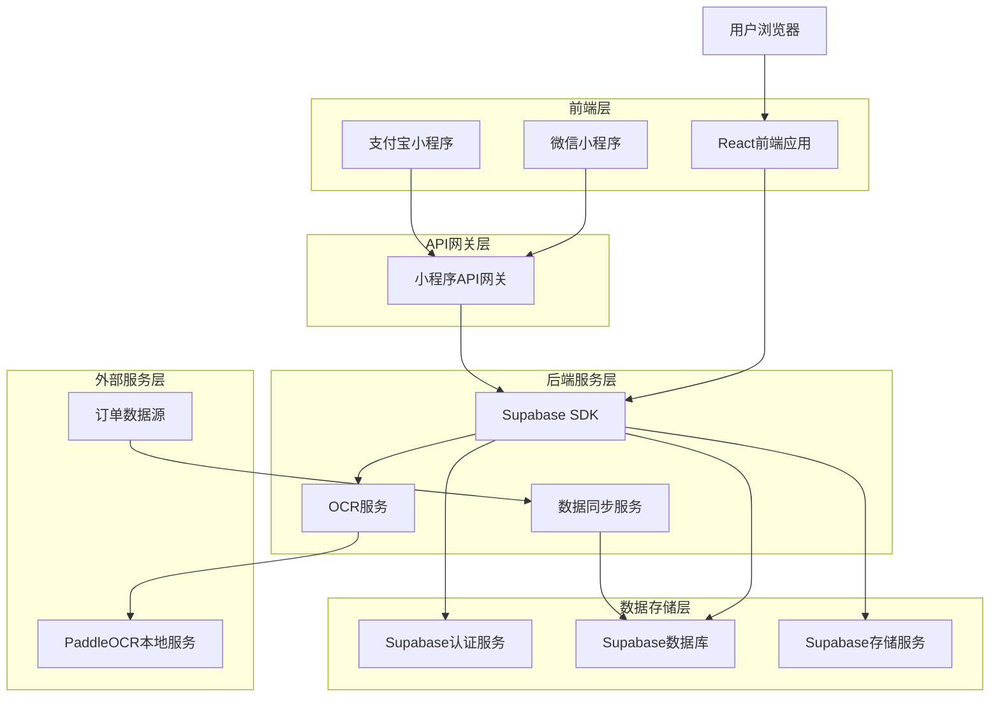
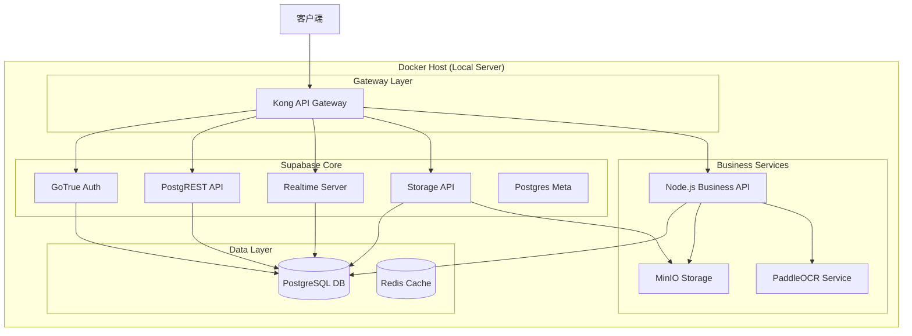
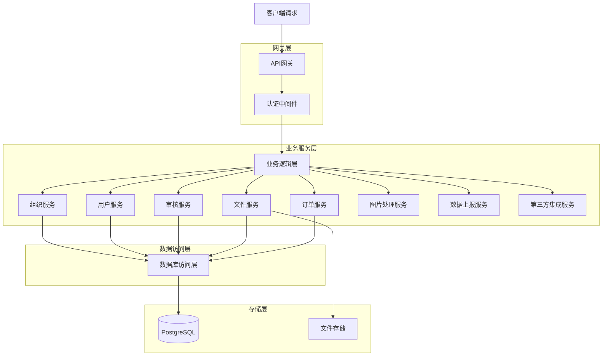
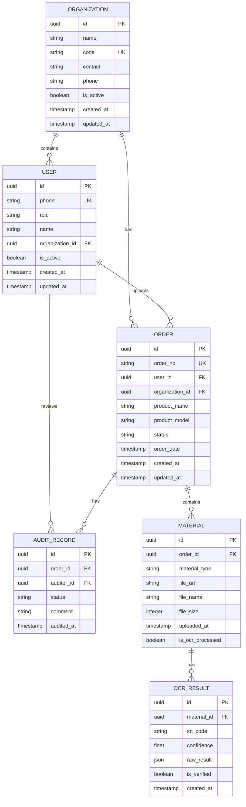

## 1. 架构设计



## 2. 技术栈描述

### 2.1 前端技术栈

* **PC端**: React@18 + TypeScript + Ant Design@5 + Vite
* **小程序**: 微信小程序原生开发 + Taro跨平台框架
* **状态管理**: Zustand轻量级状态管理
* **UI框架**: Ant Design (PC端) + Vant Weapp (小程序端)
* **初始化工具**: vite-init (PC端) + @tarojs/cli (小程序)

### 2.2 后端技术栈

* **后端服务**: Supabase (本地Docker部署)
* **认证服务**: Supabase Auth (支持手机号验证码登录)
* **数据库**: PostgreSQL (Supabase内置)
* **文件存储**: Supabase Storage / MinIO (本地部署)
* **实时功能**: Supabase Realtime
* **部署方式**: Docker Compose (全栈容器化部署)

### 2.3 第三方服务

* **OCR识别**: PaddleOCR (本地服务部署)
* **短信服务**: 自有短信接口 (后续对接)
* **文件存储**: MinIO (私有化部署备选方案)
* **图片处理**: Sharp (Node.js图片处理库)
* **图像预处理**: OpenCV.js (前端/Node.js图像处理)
* **数据上报**: 国补资料审核系统API、中央平台SFTP服务

## 3. 路由定义

### 3.1 PC端路由

| 路由               | 用途       |
| ------------------ | ---------- |
| /                  | 登录页     |
| /dashboard         | 首页仪表板 |
| /orders            | 订单列表页 |
| /orders/:id        | 订单详情页 |
| /orders/:id/upload | 材料上传页 |
| /orders/:id/ocr    | OCR识别页  |
| /audit             | 审核管理页 |
| /users             | 用户管理页 |
| /organizations     | 单位管理页 |
| /settings          | 系统设置页 |
| /profile           | 个人中心   |

### 3.2 小程序路由

| 页面路径            | 用途       |
| ------------------- | ---------- |
| pages/index/index   | 小程序首页 |
| pages/orders/list   | 订单列表   |
| pages/orders/detail | 订单详情   |
| pages/upload/photo  | 拍照上传   |
| pages/audit/result  | 审核结果   |
| pages/user/profile  | 用户中心   |

## 4. API定义

### 4.1 认证相关API

#### 用户登录

```
POST /auth/login
```

请求参数：

| 参数名 | 类型   | 必填 | 描述       |
| ------ | ------ | ---- | ---------- |
| phone  | string | 是   | 手机号     |
| code   | string | 是   | 短信验证码 |

响应：

```json
{
  "access_token": "jwt_token_string",
  "refresh_token": "refresh_token_string",
  "user": {
    "id": "user_id",
    "phone": "13800138000",
    "role": "user",
    "organization_id": "org_id"
  }
}
```

#### 获取验证码

```
POST /auth/sms-code
```

请求参数：

| 参数名 | 类型   | 必填 | 描述   |
| ------ | ------ | ---- | ------ |
| phone  | string | 是   | 手机号 |

### 4.2 组织管理API

#### 创建单位

```
POST /api/organizations
```

请求参数：

| 参数名  | 类型   | 必填 | 描述     |
| ------- | ------ | ---- | -------- |
| name    | string | 是   | 单位名称 |
| code    | string | 是   | 单位编码 |
| contact | string | 否   | 联系人   |
| phone   | string | 否   | 联系电话 |

#### 获取单位列表

```
GET /api/organizations
```

### 4.3 订单相关API

#### 获取订单列表

```
GET /api/orders
```

查询参数：

| 参数名          | 类型   | 必填 | 描述                        |
| --------------- | ------ | ---- | --------------------------- |
| page            | number | 否   | 页码，默认1                 |
| limit           | number | 否   | 每页条数，默认20            |
| status          | string | 否   | 订单状态                    |
| start_date      | string | 否   | 开始日期                    |
| end_date        | string | 否   | 结束日期                    |
| organization_id | string | 否   | 单位ID（管理员/审核员可用） |

#### 上传订单材料

```
POST /api/orders/:id/materials
```

请求体（FormData）：

```json
{
  "sn_image": File,
  "install_image": File,
  "logistics_image": File,
  "activate_image": File,
  "material_type": "sn|install|logistics|activate"
}
```

### 4.4 OCR识别API

#### SN码识别

```
POST /api/ocr/sn-code
```

请求参数：

| 参数名    | 类型   | 必填 | 描述    |
| --------- | ------ | ---- | ------- |
| image_url | string | 是   | 图片URL |

响应：

```json
{
  "success": true,
  "data": {
    "sn_code": "SN123456789",
    "confidence": 0.95
  }
}
```

### 4.5 图片处理API

#### 图片上传和转换

```
POST /api/upload/image
```

请求参数（FormData）：

| 参数名 | 类型   | 必填 | 描述     |
| ------ | ------ | ---- | -------- |
| image  | File   | 是   | 图片文件 |
| type   | string | 是   | 图片类型 |

响应：

```json
{
  "success": true,
  "data": {
    "url": "https://storage.example.com/image.png",
    "original_size": 5242880,
    "compressed_size": 2097152,
    "format": "PNG",
    "width": 1920,
    "height": 1080
  }
}
```

### 4.6 数据上报API

#### 国补资料审核系统上报

```
POST /api/report/national-subsidy
```

请求参数：

| 参数名      | 类型   | 必填 | 描述     |
| ----------- | ------ | ---- | -------- |
| order_id    | string | 是   | 订单ID   |
| report_type | string | 是   | 上报类型 |

#### 中央平台上报配置

```
GET /api/report/central-platform/config
```

```
PUT /api/report/central-platform/config
```

#### 获取上报记录

```
GET /api/report/logs
```

查询参数：

| 参数名     | 类型   | 必填 | 描述     |
| ---------- | ------ | ---- | -------- |
| type       | string | 否   | 上报类型 |
| status     | string | 否   | 上报状态 |
| start_date | string | 否   | 开始日期 |
| end_date   | string | 否   | 结束日期 |

### 4.7 第三方订单集成API

#### 同步第三方订单

```
POST /api/orders/sync
```

请求参数：

| 参数名 | 类型   | 必填 | 描述     |
| ------ | ------ | ---- | -------- |
| source | string | 是   | 订单来源 |
| orders | array  | 是   | 订单数据 |

#### 获取同步状态

```
GET /api/orders/sync/status
```

#### 获取第三方订单

```
GET /api/external/orders
```

查询参数：

| 参数名     | 类型   | 必填 | 描述     |
| ---------- | ------ | ---- | -------- |
| source     | string | 否   | 订单来源 |
| start_date | string | 否   | 开始日期 |
| end_date   | string | 否   | 结束日期 |
| status     | string | 否   | 订单状态 |

## 5. 服务器架构设计

### 5.1 本地部署架构

系统采用Docker Compose进行全栈本地化部署，包含Supabase核心组件、业务服务及第三方依赖。



### 5.2 逻辑架构设计



## 6. 数据模型设计

### 6.1 实体关系图



### 6.2 数据定义语言

#### 单位表

```sql
CREATE TABLE organizations (
    id UUID PRIMARY KEY DEFAULT gen_random_uuid(),
    name VARCHAR(200) NOT NULL,
    code VARCHAR(50) UNIQUE NOT NULL,
    contact VARCHAR(100),
    phone VARCHAR(20),
    is_active BOOLEAN DEFAULT true,
    created_at TIMESTAMP WITH TIME ZONE DEFAULT NOW(),
    updated_at TIMESTAMP WITH TIME ZONE DEFAULT NOW()
);

-- 创建索引
CREATE INDEX idx_organizations_code ON organizations(code);
CREATE INDEX idx_organizations_name ON organizations(name);

-- 授权
GRANT SELECT ON organizations TO anon;
GRANT ALL PRIVILEGES ON organizations TO authenticated;
```

#### 用户表

```sql
CREATE TABLE users (
    id UUID PRIMARY KEY DEFAULT gen_random_uuid(),
    phone VARCHAR(20) UNIQUE NOT NULL,
    password_hash VARCHAR(255),
    name VARCHAR(100),
    role VARCHAR(20) DEFAULT 'user' CHECK (role IN ('user', 'auditor', 'admin', 'installer')),
    organization_id UUID REFERENCES organizations(id),
    is_active BOOLEAN DEFAULT true,
    created_at TIMESTAMP WITH TIME ZONE DEFAULT NOW(),
    updated_at TIMESTAMP WITH TIME ZONE DEFAULT NOW()
);

-- 创建索引
CREATE INDEX idx_users_phone ON users(phone);
CREATE INDEX idx_users_role ON users(role);
CREATE INDEX idx_users_organization_id ON users(organization_id);

-- 授权
GRANT SELECT ON users TO anon;
GRANT ALL PRIVILEGES ON users TO authenticated;
```

#### 订单表

```sql
CREATE TABLE orders (
    id UUID PRIMARY KEY DEFAULT gen_random_uuid(),
    mchnt_ord_no VARCHAR(50) UNIQUE NOT NULL, -- 商户订单号
    plate_type VARCHAR(20) NOT NULL CHECK (plate_type IN ('home_appliance', 'digital_3c', 'home_decoration', 'aging_adaptation')), -- 板块类型
  
    -- 基础关联
    user_id UUID REFERENCES users(id),
    organization_id UUID REFERENCES organizations(id),
  
    -- 通用商品信息
    product_name VARCHAR(200),
    product_model VARCHAR(100),
    product_brand VARCHAR(100),
    product_category VARCHAR(100),
    product_category_code VARCHAR(50),
  
    -- 通用发票信息
    invoice_no VARCHAR(100),
    invoice_date DATE,
    invoice_amount DECIMAL(10, 2),
    invoice_subsidy_amount DECIMAL(10, 2),
  
    -- 状态管理
    status VARCHAR(20) DEFAULT 'pending' CHECK (status IN ('pending', 'uploading', 'auditing', 'approved', 'rejected')),
  
    -- 差异化字段存储 (JSONB)
    -- 存储: pc_tp, goods_energy, imei1, imei2, etc.
    extra_info JSONB DEFAULT '{}',
  
    created_at TIMESTAMP WITH TIME ZONE DEFAULT NOW(),
    updated_at TIMESTAMP WITH TIME ZONE DEFAULT NOW()
);

-- 创建索引
CREATE INDEX idx_orders_user_id ON orders(user_id);
CREATE INDEX idx_orders_organization_id ON orders(organization_id);
CREATE INDEX idx_orders_status ON orders(status);
CREATE INDEX idx_orders_mchnt_ord_no ON orders(mchnt_ord_no);
CREATE INDEX idx_orders_plate_type ON orders(plate_type);
CREATE INDEX idx_orders_created_at ON orders(created_at DESC);

-- 授权
GRANT SELECT ON orders TO anon;
GRANT ALL PRIVILEGES ON orders TO authenticated;
```

#### 材料表

```sql
CREATE TABLE materials (
    id UUID PRIMARY KEY DEFAULT gen_random_uuid(),
    order_id UUID REFERENCES orders(id) ON DELETE CASCADE,
    -- image0-image5 对应的业务类型
    material_type VARCHAR(50) NOT NULL, 
    -- 原始字段名映射 (image0, image1, etc.)
    image_index VARCHAR(10) CHECK (image_index IN ('image0', 'image1', 'image2', 'image3', 'image4', 'image5')),
  
    file_url TEXT NOT NULL,
    file_name VARCHAR(255),
    file_size INTEGER,
    uploaded_at TIMESTAMP WITH TIME ZONE DEFAULT NOW(),
    is_ocr_processed BOOLEAN DEFAULT false
);

-- 创建索引
CREATE INDEX idx_materials_order_id ON materials(order_id);
CREATE INDEX idx_materials_type ON materials(material_type);

-- 授权
GRANT SELECT ON materials TO anon;
GRANT ALL PRIVILEGES ON materials TO authenticated;
```

#### OCR结果表

```sql
CREATE TABLE ocr_results (
    id UUID PRIMARY KEY DEFAULT gen_random_uuid(),
    material_id UUID REFERENCES materials(id) ON DELETE CASCADE,
    sn_code VARCHAR(100),
    confidence FLOAT,
    raw_result JSONB,
    is_verified BOOLEAN DEFAULT false,
    created_at TIMESTAMP WITH TIME ZONE DEFAULT NOW()
);

-- 创建索引
CREATE INDEX idx_ocr_material_id ON ocr_results(material_id);
CREATE INDEX idx_ocr_sn_code ON ocr_results(sn_code);

-- 授权
GRANT SELECT ON ocr_results TO anon;
GRANT ALL PRIVILEGES ON ocr_results TO authenticated;
```

#### 审核记录表

```sql
CREATE TABLE audit_records (
    id UUID PRIMARY KEY DEFAULT gen_random_uuid(),
    order_id UUID REFERENCES orders(id) ON DELETE CASCADE,
    auditor_id UUID REFERENCES users(id),
    status VARCHAR(20) CHECK (status IN ('approved', 'rejected')),
    comment TEXT,
    audited_at TIMESTAMP WITH TIME ZONE DEFAULT NOW()
);

-- 创建索引
CREATE INDEX idx_audit_order_id ON audit_records(order_id);
CREATE INDEX idx_audit_auditor_id ON audit_records(auditor_id);
CREATE INDEX idx_audit_audited_at ON audit_records(audited_at DESC);

-- 授权
GRANT SELECT ON audit_records TO anon;
GRANT ALL PRIVILEGES ON audit_records TO authenticated;
```

### 6.3 行级安全策略(RLS)

#### 用户数据隔离策略

```sql
-- 用户只能查看自己组织的数据（普通用户和安装师傅）
CREATE POLICY "用户只能查看本单位数据" ON orders
    FOR SELECT
    USING (
        organization_id = (
            SELECT organization_id FROM users WHERE id = auth.uid()
        ) 
        OR 
        EXISTS (
            SELECT 1 FROM users WHERE id = auth.uid() 
            AND role IN ('admin', 'auditor')
        )
    );

-- 用户只能查看自己组织的数据（材料表）
CREATE POLICY "用户只能查看本单位材料" ON materials
    FOR SELECT
    USING (
        EXISTS (
            SELECT 1 FROM orders 
            WHERE orders.id = materials.order_id 
            AND orders.organization_id = (
                SELECT organization_id FROM users WHERE id = auth.uid()
            )
        )
        OR 
        EXISTS (
            SELECT 1 FROM users WHERE id = auth.uid() 
            AND role IN ('admin', 'auditor')
        )
    );

-- 用户只能查看自己组织的数据（用户表）
CREATE POLICY "用户只能查看本单位用户" ON users
    FOR SELECT
    USING (
        organization_id = (
            SELECT organization_id FROM users WHERE id = auth.uid()
        ) 
        OR 
        role IN ('admin', 'auditor')
    );
```

#### 数据修改策略

```sql
-- 普通用户只能修改自己的数据
CREATE POLICY "用户只能修改自己的数据" ON orders
    FOR UPDATE
    USING (
        user_id = auth.uid()
        AND status IN ('pending', 'uploading')
    );

-- 审核员可以更新订单状态
CREATE POLICY "审核员可以审核订单" ON orders
    FOR UPDATE
    USING (
        EXISTS (
            SELECT 1 FROM users WHERE id = auth.uid() 
            AND role = 'auditor'
        )
    );

-- 管理员可以更新所有数据
CREATE POLICY "管理员可以更新所有数据" ON orders
    FOR ALL
    USING (
        EXISTS (
            SELECT 1 FROM users WHERE id = auth.uid() 
            AND role = 'admin'
        )
    );
```

### 6.4 数据上报表

#### 上报配置表

```sql
CREATE TABLE report_configs (
    id UUID PRIMARY KEY DEFAULT gen_random_uuid(),
    report_type VARCHAR(50) NOT NULL CHECK (report_type IN ('national_subsidy', 'central_platform')),
    is_enabled BOOLEAN DEFAULT false,
    config_data JSONB,
    cron_expression VARCHAR(100),
    last_run_at TIMESTAMP WITH TIME ZONE,
    created_at TIMESTAMP WITH TIME ZONE DEFAULT NOW(),
    updated_at TIMESTAMP WITH TIME ZONE DEFAULT NOW()
);

-- 创建索引
CREATE INDEX idx_report_configs_type ON report_configs(report_type);

-- 授权
GRANT SELECT ON report_configs TO anon;
GRANT ALL PRIVILEGES ON report_configs TO authenticated;
```

#### 上报记录表

```sql
CREATE TABLE report_logs (
    id UUID PRIMARY KEY DEFAULT gen_random_uuid(),
    report_type VARCHAR(50) NOT NULL,
    order_id UUID REFERENCES orders(id),
    status VARCHAR(20) DEFAULT 'pending' CHECK (status IN ('pending', 'success', 'failed')),
    response_data JSONB,
    error_message TEXT,
    retry_count INTEGER DEFAULT 0,
    created_at TIMESTAMP WITH TIME ZONE DEFAULT NOW(),
    completed_at TIMESTAMP WITH TIME ZONE
);

-- 创建索引
CREATE INDEX idx_report_logs_type ON report_logs(report_type);
CREATE INDEX idx_report_logs_status ON report_logs(status);
CREATE INDEX idx_report_logs_created_at ON report_logs(created_at DESC);

-- 授权
GRANT SELECT ON report_logs TO anon;
GRANT ALL PRIVILEGES ON report_logs TO authenticated;
```

### 6.6 第三方订单集成表

#### 第三方订单来源表

```sql
CREATE TABLE external_order_sources (
    id UUID PRIMARY KEY DEFAULT gen_random_uuid(),
    name VARCHAR(100) NOT NULL,
    source_code VARCHAR(50) UNIQUE NOT NULL,
    api_config JSONB,
    is_active BOOLEAN DEFAULT true,
    created_at TIMESTAMP WITH TIME ZONE DEFAULT NOW(),
    updated_at TIMESTAMP WITH TIME ZONE DEFAULT NOW()
);

-- 创建索引
CREATE INDEX idx_external_sources_code ON external_order_sources(source_code);

-- 授权
GRANT SELECT ON external_order_sources TO anon;
GRANT ALL PRIVILEGES ON external_order_sources TO authenticated;
```

#### 第三方订单表

```sql
CREATE TABLE external_orders (
    id UUID PRIMARY KEY DEFAULT gen_random_uuid(),
    source_id UUID REFERENCES external_order_sources(id),
    external_order_id VARCHAR(100) NOT NULL,
    order_data JSONB,
    sync_status VARCHAR(20) DEFAULT 'pending' CHECK (sync_status IN ('pending', 'synced', 'failed')),
    sync_error TEXT,
    synced_at TIMESTAMP WITH TIME ZONE,
    created_at TIMESTAMP WITH TIME ZONE DEFAULT NOW(),
    updated_at TIMESTAMP WITH TIME ZONE DEFAULT NOW(),
    UNIQUE(source_id, external_order_id)
);

-- 创建索引
CREATE INDEX idx_external_orders_source ON external_orders(source_id);
CREATE INDEX idx_external_orders_status ON external_orders(sync_status);
CREATE INDEX idx_external_orders_synced_at ON external_orders(synced_at);

-- 授权
GRANT SELECT ON external_orders TO anon;
GRANT ALL PRIVILEGES ON external_orders TO authenticated;
```

### 6.7 初始数据

```sql
-- 创建默认单位
INSERT INTO organizations (name, code, contact, phone) VALUES 
('默认单位', 'DEFAULT', '系统管理员', '13800138000');

-- 创建管理员用户
INSERT INTO users (phone, name, role, organization_id, is_active) VALUES 
('13800138000', '系统管理员', 'admin', (SELECT id FROM organizations WHERE code = 'DEFAULT'), true);

-- 创建审核员用户
INSERT INTO users (phone, name, role, organization_id, is_active) VALUES 
('13800138001', '审核员1', 'auditor', (SELECT id FROM organizations WHERE code = 'DEFAULT'), true),
('13800138002', '审核员2', 'auditor', (SELECT id FROM organizations WHERE code = 'DEFAULT'), true);

-- 创建默认上报配置
INSERT INTO report_configs (report_type, is_enabled, config_data, cron_expression) VALUES 
('national_subsidy', false, '{"api_url": "", "api_key": ""}', '0 */1 * * *'),
('central_platform', false, '{"sftp_host": "", "sftp_port": 22, "sftp_username": "", "sftp_password": ""}', '0 2 * * *');

-- 创建默认第三方订单来源
INSERT INTO external_order_sources (name, source_code, api_config) VALUES 
('预留系统1', 'SYSTEM_1', '{"api_url": "", "api_key": "", "timeout": 30}'),
('预留系统2', 'SYSTEM_2', '{"api_url": "", "api_key": "", "timeout": 30}');

```sql
-- 创建默认单位
INSERT INTO organizations (name, code, contact, phone) VALUES 
('默认单位', 'DEFAULT', '系统管理员', '13800138000');

-- 创建管理员用户
INSERT INTO users (phone, name, role, organization_id, is_active) VALUES 
('13800138000', '系统管理员', 'admin', (SELECT id FROM organizations WHERE code = 'DEFAULT'), true);

-- 创建审核员用户
INSERT INTO users (phone, name, role, organization_id, is_active) VALUES 
('13800138001', '审核员1', 'auditor', (SELECT id FROM organizations WHERE code = 'DEFAULT'), true),
('13800138002', '审核员2', 'auditor', (SELECT id FROM organizations WHERE code = 'DEFAULT'), true);

-- 创建默认上报配置
INSERT INTO report_configs (report_type, is_enabled, config_data, cron_expression) VALUES 
('national_subsidy', false, '{"api_url": "", "api_key": ""}', '0 */1 * * *'),
('central_platform', false, '{"sftp_host": "", "sftp_port": 22, "sftp_username": "", "sftp_password": ""}', '0 2 * * *');
```

## 7. OCR识别优化技术实现

### 7.1 图像预处理流程

在调用云端OCR接口前，在客户端或服务端进行图像预处理，以提高识别准确率。

```javascript
// 伪代码示例：使用OpenCV.js进行预处理
function preprocessImage(imageSource) {
    let src = cv.imread(imageSource);
    let dst = new cv.Mat();
  
    // 1. 灰度化
    cv.cvtColor(src, dst, cv.COLOR_RGBA2GRAY, 0);
  
    // 2. 高斯模糊去噪
    let ksize = new cv.Size(5, 5);
    cv.GaussianBlur(dst, dst, ksize, 0, 0, cv.BORDER_DEFAULT);
  
    // 3. 自适应阈值二值化
    cv.adaptiveThreshold(dst, dst, 255, cv.ADAPTIVE_THRESH_GAUSSIAN_C, cv.THRESH_BINARY, 11, 2);
  
    // 4. 形态学操作（开运算）去除噪点
    let M = cv.Mat.ones(3, 3, cv.CV_8U);
    cv.morphologyEx(dst, dst, cv.MORPH_OPEN, M);
  
    return dst;
}
```

### 7.2 SN码后处理逻辑

OCR识别返回结果后，通过正则表达式和校验算法进行清洗和修正。

```javascript
// 常见SN码格式正则库
const SN_PATTERNS = {
    'BRAND_A': /^[A-Z0-9]{15}$/,
    'BRAND_B': /^[0-9]{12}$/,
    'GENERAL': /^[A-Z0-9-]{10,20}$/
};

// 易混淆字符修正表
const CORRECTIONS = {
    'O': '0',
    'I': '1',
    'B': '8',
    'Z': '2',
    'S': '5'
};

function postProcessOCR(ocrResult) {
    let snCandidate = ocrResult.text.replace(/\s/g, '').toUpperCase();
  
    // 1. 字符修正（根据置信度判断是否需要修正）
    if (ocrResult.confidence < 0.9) {
        snCandidate = snCandidate.split('').map(char => CORRECTIONS[char] || char).join('');
    }
  
    // 2. 正则校验
    for (let [brand, pattern] of Object.entries(SN_PATTERNS)) {
        if (pattern.test(snCandidate)) {
            return { sn: snCandidate, valid: true, type: brand };
        }
    }
  
    return { sn: snCandidate, valid: false, warning: "格式不匹配" };
}
```

### 7.3 置信度评分机制

综合OCR引擎返回的置信度和自定义规则，计算最终的可信度分数。

- **OCR引擎置信度** (权重 60%)
- **格式匹配度** (权重 30%)
- **图像清晰度评分** (权重 10%)

若总分低于设定阈值（如0.8），则强制要求人工复核。

## 8. 安全策略

### 8.1 认证授权

* 使用JWT Token进行用户认证
* 基于角色的访问控制（RBAC）
* API接口需要token验证
* 定期刷新access token
* **组织隔离**：用户只能访问所属组织的数据

### 8.2 数据安全

* 敏感数据加密存储
* 图片上传支持私有访问
* 数据库连接使用SSL加密
* 定期备份重要数据
* **行级安全**：使用PostgreSQL RLS实现数据隔离

### 8.3 网络安全

* HTTPS协议传输
* CORS跨域安全配置
* API请求频率限制
* SQL注入防护

## 8. 部署架构

### 8.1 开发环境

* 本地开发使用Supabase CLI
* 前端使用Vite开发服务器
* 支持热重载和实时预览

### 8.2 生产环境

* 前端部署到Vercel/Netlify
* Supabase使用官方云服务
* 配置自定义域名和SSL证书
* 启用CDN加速静态资源

### 8.3 监控运维

* 使用Supabase内置监控
* 配置错误日志收集
* 设置性能监控告警
* 定期性能优化
